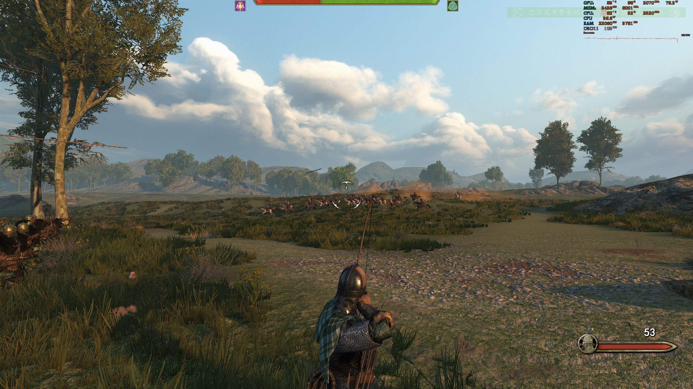
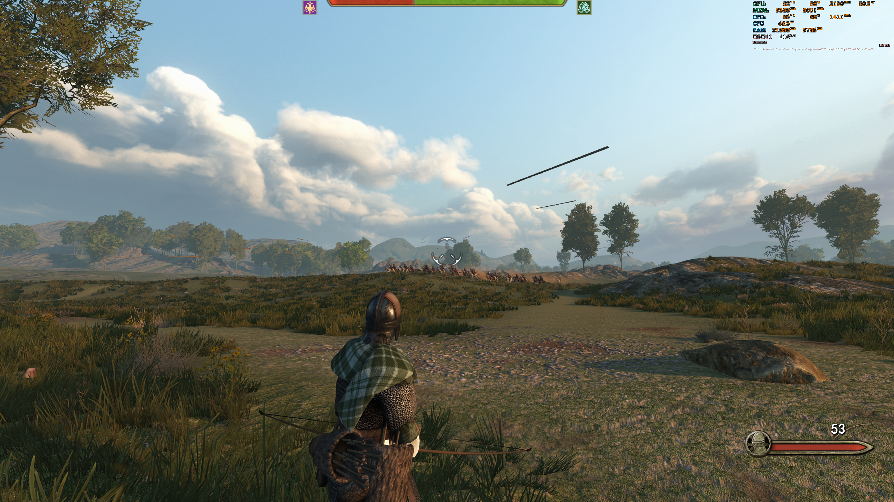
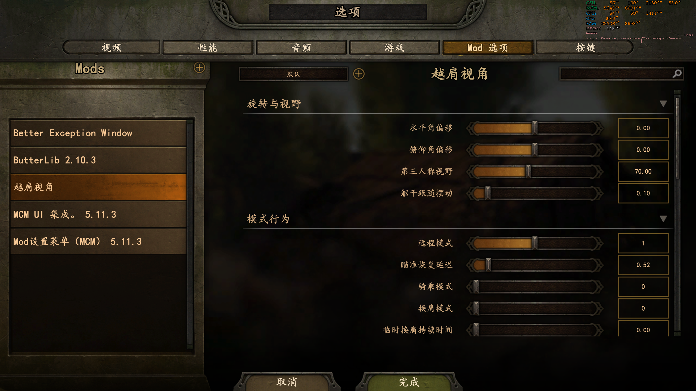

<p align="center">
  
</p>

# Shoulder Cam — Bannerlord 1.3.15–1.4.x Fix

[简体中文](README.zh-CN.md) · [Nexus Mods](https://www.nexusmods.com/mountandblade2bannerlord/mods/11295) · [Changelog](CHANGELOG.md)

An over-the-shoulder third-person camera mod for Mount & Blade II: Bannerlord. This maintained revision restores the MCM menu, adds English and Simplified Chinese localization, cleans up dependencies, and fixes ranged aiming, configuration saving, and temporary shoulder switching.

Current release: `v1.0.0`
Supported game versions: Bannerlord `v1.3.15–v1.4.x`

| Vanilla camera | Shoulder Cam |
| --- | --- |
|  |  |

## Features

- Separate on-foot and mounted camera offsets.
- Configurable position, field of view, bearing, elevation, and torso sway.
- Three ranged-weapon modes, including revert-to-vanilla only while aiming.
- Optional vanilla camera while mounted.
- Permanent or timed shoulder switching based on attack/block direction.
- Configurable hit camera shake.
- In-game MCM configuration with complete `config.json` coverage.
- English and Simplified Chinese XML localization.
- Live configuration reload.

## Requirements

- Mount & Blade II: Bannerlord `v1.3.15–v1.4.x`
- [Bannerlord.Harmony](https://www.nexusmods.com/mountandblade2bannerlord/mods/2006), tested with `v2.4.2.225`
- Bannerlord.MBOptionScreen / MCM, tested with `v5.11.3`
- Singleplayer

Do not add another `0Harmony.dll` to this module. Harmony is supplied by the `Bannerlord.Harmony` dependency.

## Installation

1. Download `ShoulderCam-v1.0.0.zip` from GitHub Releases or Nexus Mods.
2. Extract the `ShoulderCam` folder into:

   ```text
   Mount & Blade II Bannerlord\Modules
   ```

3. Enable the modules in this order:

   ```text
   Bannerlord.Harmony
   Bannerlord.MBOptionScreen
   Shoulder Cam
   ```

4. Open Mod Options / MCM in game to configure the camera.

The module is camera-only and does not add campaign save data. It can generally be added or removed between game launches. Never replace or remove its DLL while the game is running.

## Configuration

Settings are stored in:

```text
ShoulderCam\bin\Win64_Shipping_Client\config.json
```

Use MCM for normal configuration. Manual edits can be reloaded while the game is running when `enableLiveConfigUpdates` is enabled. The packaged [module README](ShoulderCam/README.md) documents every setting.



## Build

The repository contains the reconstructed and maintained C# project used to produce the bundled DLL. Build on Windows with .NET SDK and the required Bannerlord modules installed:

```powershell
dotnet build .\src\ShoulderCam\ShoulderCam.csproj -c Release `
  -p:BannerlordDir="E:\Games\Mount & Blade II Bannerlord"
```

The output is written directly to `ShoulderCam\bin\Win64_Shipping_Client`.

## Versioning and releases

- Versions follow [Semantic Versioning](https://semver.org/).
- `SubModule.xml`, assembly metadata, changelog, and Git tag must use the same version.
- Release tags use `vMAJOR.MINOR.PATCH`.
- Pushing a matching tag runs the release workflow and packages the install-ready `ShoulderCam` folder.
- User-facing changes belong in [CHANGELOG.md](CHANGELOG.md).

See [CONTRIBUTING.md](CONTRIBUTING.md) for the update checklist.

## Credits and permissions

- **Xorberax** — original Shoulder Cam logic.
- **RitchieRitteer** — updated Shoulder Camera Mod, MCM version, and expanded camera behavior.
- **Firefly Julius** — Bannerlord 1.3.15–1.4.x revision, dependency cleanup, MCM restoration, localization, and behavior fixes.

This repository contains work derived from multiple authors. No open-source license is asserted here. Copyright and redistribution rights remain with their respective authors; consult the linked Nexus pages and obtain permission before redistributing or reusing assets.
