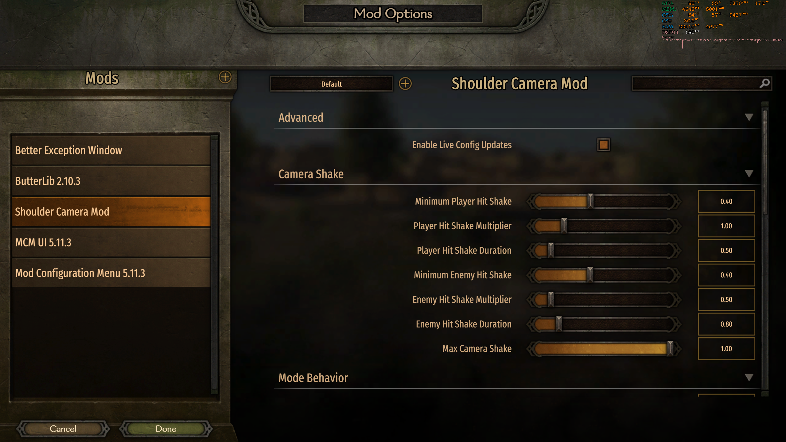

<p align="center">
  
</p>

# 越肩视角 Shoulder Cam — 霸主 1.3.15–1.4.x 修复版

[English](README.md) · [Nexus Mods](https://www.nexusmods.com/mountandblade2bannerlord/mods/11295) · [更新日志](CHANGELOG.md)

这是《骑马与砍杀 2：霸主》的第三人称越肩相机 Mod。本修复版恢复了 MCM 设置菜单，加入英文与简体中文 XML 本地化，清理旧依赖，并修复远程瞄准、配置保存和临时换肩等问题。

当前版本：`v1.0.0`
支持游戏版本：Bannerlord `v1.3.15–v1.4.x`

| 原版第三人称 | 越肩视角 |
| --- | --- |
|  |  |

## 主要功能

- 步行和骑乘分别设置相机偏移。
- 调整相机位置、视野、水平角、俯仰角和躯干跟随摆动。
- 三种远程武器模式，包括“仅在瞄准时恢复原版相机”。
- 可选择骑乘时恢复原版相机。
- 根据攻击/格挡方向持续或临时换肩。
- 可配置玩家受击和命中敌人时的相机震动。
- MCM 游戏内设置，完整覆盖 `config.json` 字段。
- 英文和简体中文 XML 本地化。
- 支持游戏运行时重新读取配置。

## 前置需求

- Mount & Blade II: Bannerlord `v1.3.15–v1.4.x`
- [Bannerlord.Harmony](https://www.nexusmods.com/mountandblade2bannerlord/mods/2006)，测试版本 `v2.4.2.225`
- Bannerlord.MBOptionScreen / MCM，测试版本 `v5.11.3`
- 仅单人模式

不要向本模块加入额外的 `0Harmony.dll`；Harmony 应由 `Bannerlord.Harmony` 前置模块提供。

## 安装

1. 从 GitHub Releases 或 Nexus Mods 下载 `ShoulderCam-v1.0.0.zip`。
2. 将压缩包中的 `ShoulderCam` 文件夹解压到：

   ```text
   Mount & Blade II Bannerlord\Modules
   ```

3. 按以下顺序启用：

   ```text
   Bannerlord.Harmony
   Bannerlord.MBOptionScreen
   Shoulder Cam
   ```

4. 进入游戏内 Mod Options / MCM 菜单调整相机。

本 Mod 只修改相机运行逻辑，不写入自定义战役存档数据，通常可在完全退出游戏后添加或移除。不要在游戏运行时替换或删除 DLL。

## 配置

配置文件位于：

```text
ShoulderCam\bin\Win64_Shipping_Client\config.json
```

建议通过 MCM 修改。开启 `enableLiveConfigUpdates` 后，也可在游戏运行时手动编辑并重新加载。所有选项的详细说明见[模块中文说明](ShoulderCam/README-CN.md)。



## 编译

仓库保存了生成当前 DLL 的重建与维护版 C# 工程。在 Windows 上安装 .NET SDK 和所需的 Bannerlord 前置模块后执行：

```powershell
dotnet build .\src\ShoulderCam\ShoulderCam.csproj -c Release `
  -p:BannerlordDir="E:\Games\Mount & Blade II Bannerlord"
```

输出会直接写入 `ShoulderCam\bin\Win64_Shipping_Client`。

## 版本管理

- 使用[语义化版本](https://semver.org/lang/zh-CN/)。
- `SubModule.xml`、程序集版本、更新日志和 Git 标签必须一致。
- 发布标签格式为 `v主版本.次版本.修订号`。
- 推送版本标签后，GitHub Actions 会自动打包可直接安装的 `ShoulderCam` 文件夹并创建 Release。
- 所有玩家可见的改动都记录在 [CHANGELOG.md](CHANGELOG.md)。

具体更新步骤见 [CONTRIBUTING.md](CONTRIBUTING.md)。

## 作者、鸣谢与权限

- **Xorberax**：原始 Shoulder Cam 核心逻辑作者。
- **RitchieRitteer**：更新版 Shoulder Camera Mod、MCM 版本和扩展相机逻辑。
- **Firefly Julius**：Bannerlord 1.3.15–1.4.x 修复、依赖清理、MCM 恢复、多语言与行为修正。

本仓库包含多位作者的衍生工作，未声明开源许可证。各部分著作权与再分发权仍归相应作者所有；再分发或复用前请查看相关 Nexus 页面并取得必要许可。
